# BattleBeam — IoT Entertainment System

BattleBeam is a team graduation project that brings laser-tag gameplay into the home using infrared communication, ESP32/ESP8266 microcontrollers, Wi-Fi, WebSockets, and a Flutter mobile application.

Instead of relying on a commercial arena, BattleBeam uses physical laser-tag guns, wearable hit-detection vests, a central ESP32 hub, and a mobile app to manage players, teams, equipment, live scoring, and game results.

## Team

BattleBeam was developed collaboratively by:

- Seham Alharbi
- Layan Aldawood
- Aisha Alhamed

**Supervisor:** Dr. Tadani Alyahya

---

## Project Overview

The system was designed as an affordable and portable indoor laser-tag experience for families and friends.

Players use an ESP32-based gun that transmits encoded infrared shots and an ESP8266-based vest that detects hits. A central ESP32 hub coordinates the game over a local Wi-Fi network and exchanges real-time data with the Flutter mobile application through WebSockets.

The application allows players to connect to the hub, enter their name, choose a team, select their assigned gun and vest, join the lobby, follow the score during gameplay, and view the winning team at the end of the match.

## System Architecture

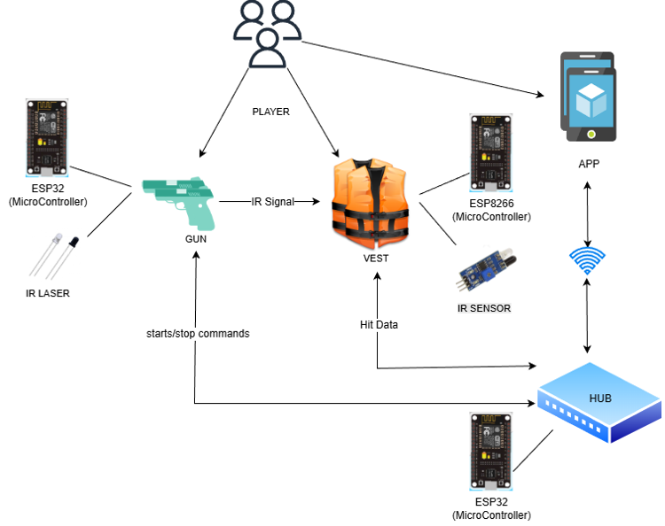

The hub acts as the central controller for the system:

1. The mobile application connects to the hub over Wi-Fi.
2. Guns and vests also connect to the hub.
3. The leader configures the target score and starts the match.
4. Guns transmit encoded IR shots.
5. Vests detect valid shots and report hit events.
6. The hub validates the hit, applies gameplay rules, updates the score, and sends the new game state to connected mobile devices.

---

## Hardware

<table>
  <tr>
    <td align="center">
      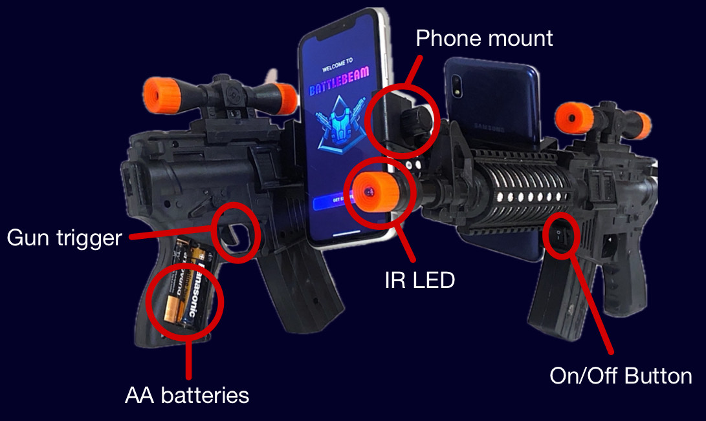<br>
      <b>ESP32 Gun</b>
    </td>
    <td align="center">
      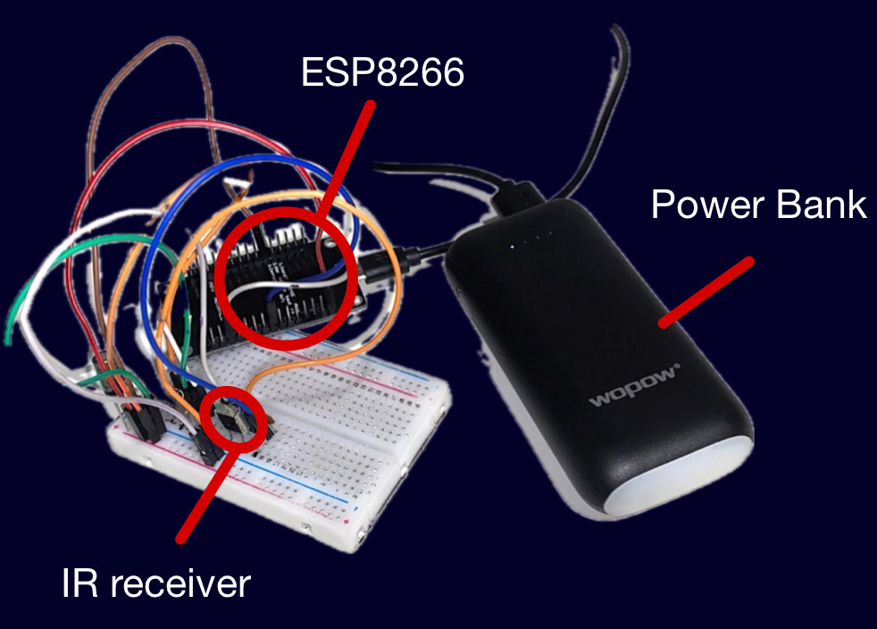<br>
      <b>ESP8266 Vest Electronics</b>
    </td>
    <td align="center">
      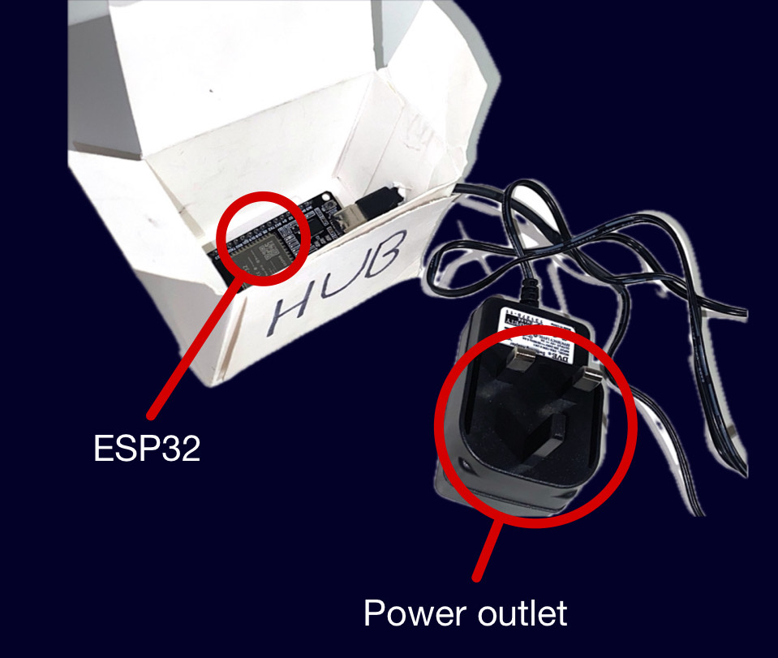<br>
      <b>ESP32 Hub</b>
    </td>
  </tr>
</table>

### Gun

The gun uses an ESP32 microcontroller and an infrared emitter. The trigger initiates an encoded IR transmission that identifies the shooter during gameplay.

Main responsibilities:

- Connect to the BattleBeam hub
- Handle trigger input
- Transmit encoded IR shots
- Receive game-state commands from the hub
- Disable shooting temporarily when required by the game state

### Vest

The wearable vest uses an ESP8266 with IR receivers to detect incoming shots.

Main responsibilities:

- Detect infrared hits
- Send hit events to the central hub
- Participate in player cooldown/reactivation behavior
- Remain portable using a power bank

A photo of the wearable prototype is included below.

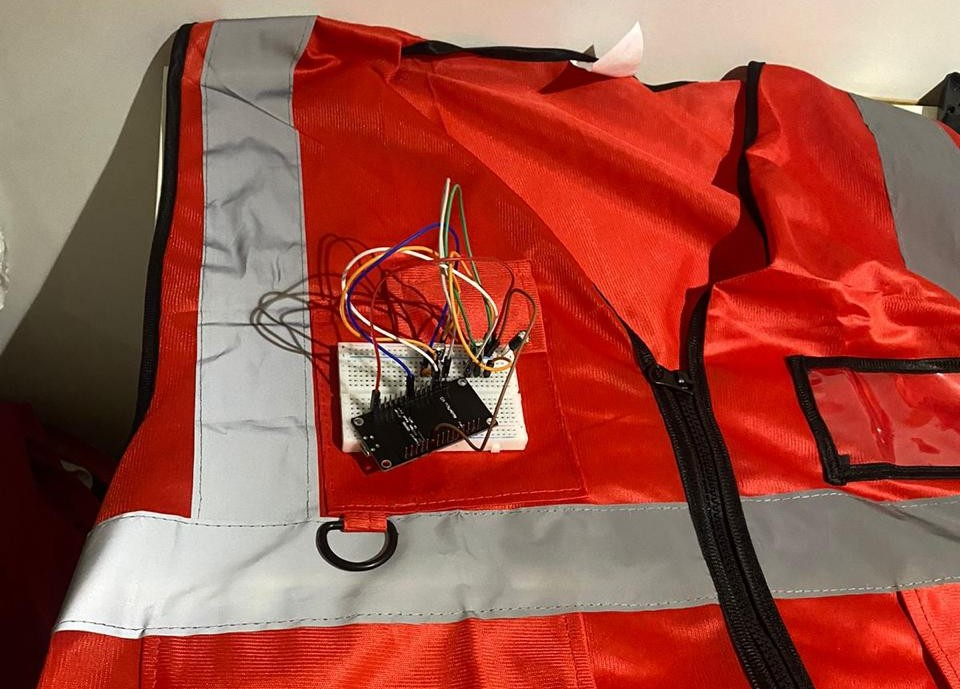

### Hub

The central ESP32 hub creates and manages the local BattleBeam network and coordinates gameplay.

It is responsible for:

- Device and player connections
- Team/player state
- Target score
- Hit validation
- Friendly-fire prevention
- Score updates
- Player cooldown/reactivation
- Start/end game control
- Real-time WebSocket communication with the mobile app

---

## Mobile Application

The cross-platform application was built with Flutter for Android and iOS.

### Player setup

<table>
  <tr>
    <td align="center">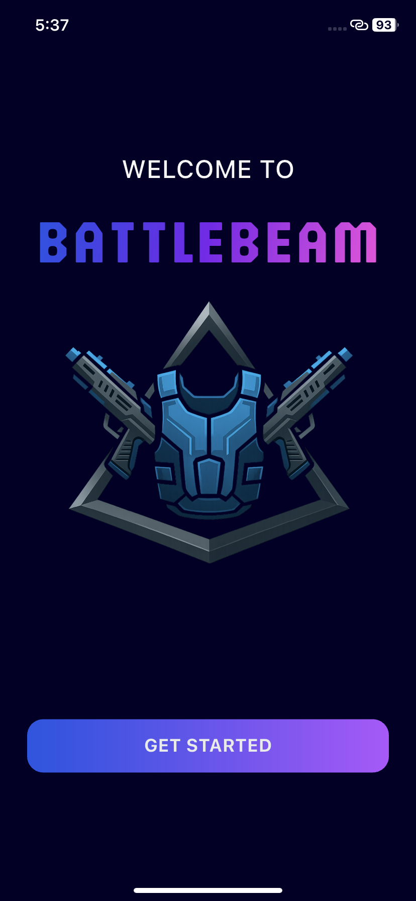<br><b>Welcome</b></td>
    <td align="center">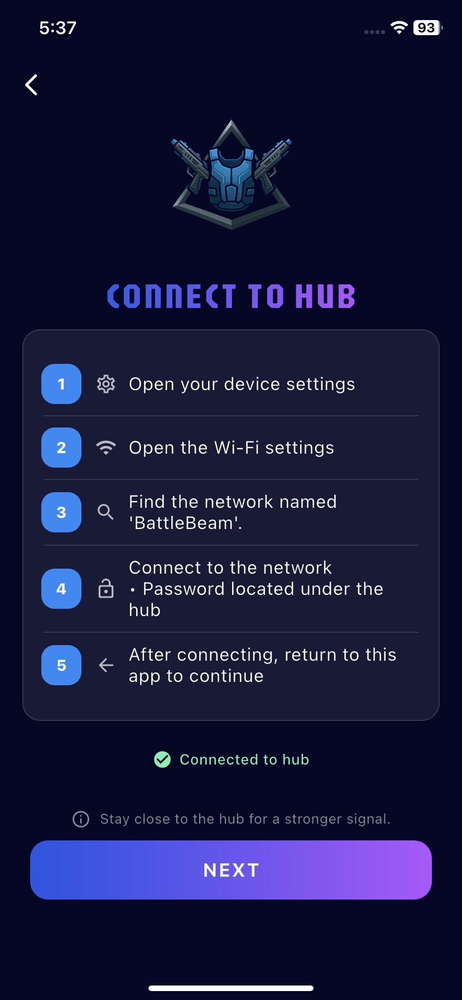<br><b>Connect to Hub</b></td>
    <td align="center">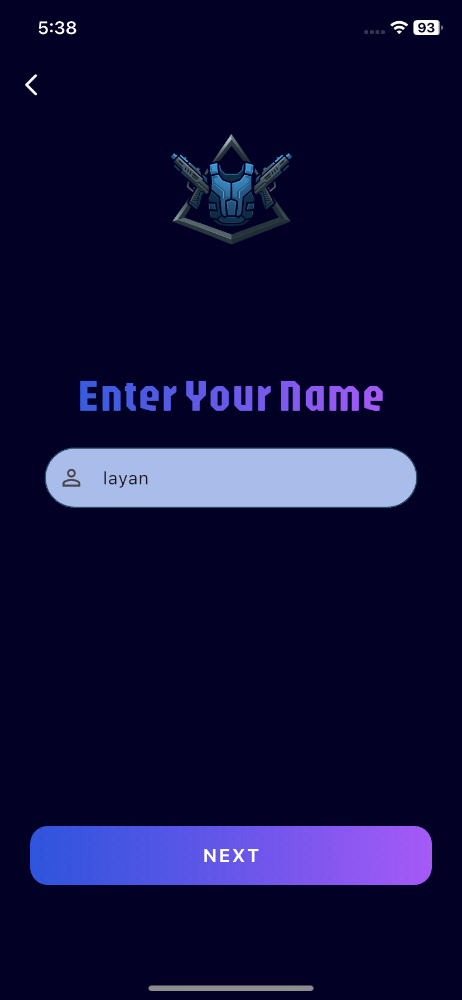<br><b>Player Name</b></td>
  </tr>
</table>

### Team and equipment setup

Each player chooses a team and selects the physical gun and vest they will use. The screenshots below show equipment assignment for both teams.

<table>
  <tr>
    <td align="center">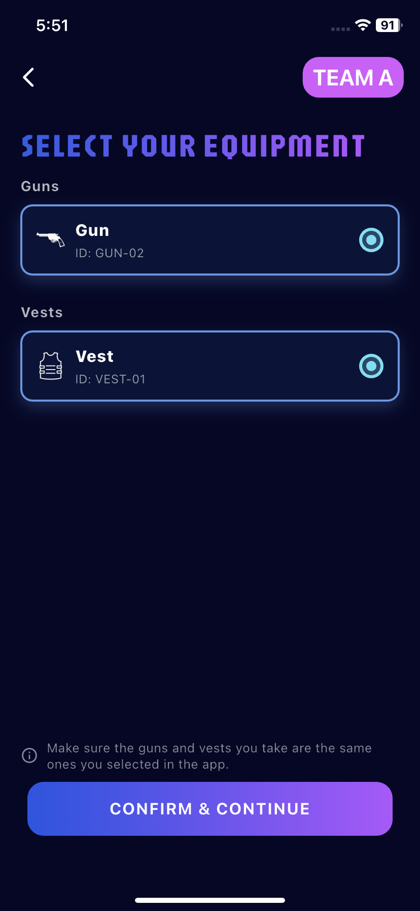<br><b>Team A Equipment</b></td>
    <td align="center">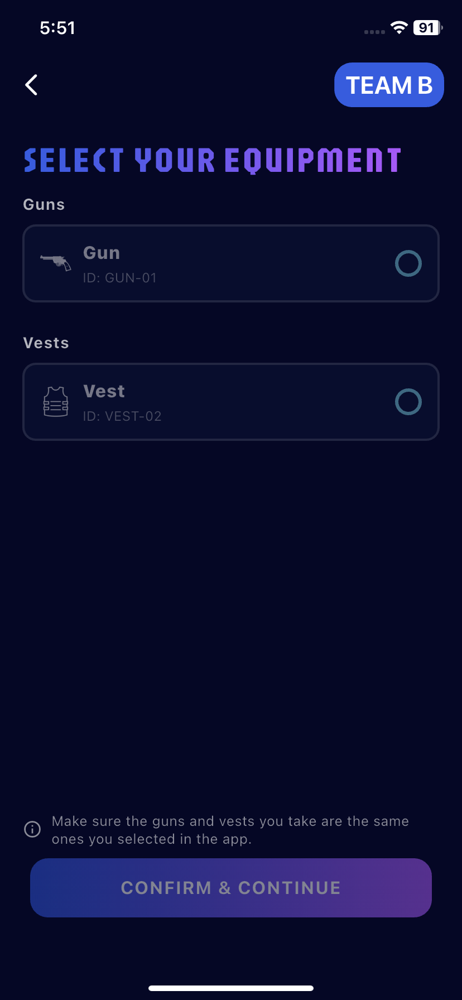<br><b>Team B Equipment</b></td>
    <td align="center">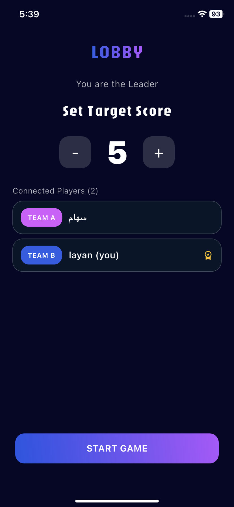<br><b>Lobby / Target Score</b></td>
  </tr>
</table>

### Gameplay

<table>
  <tr>
    <td align="center">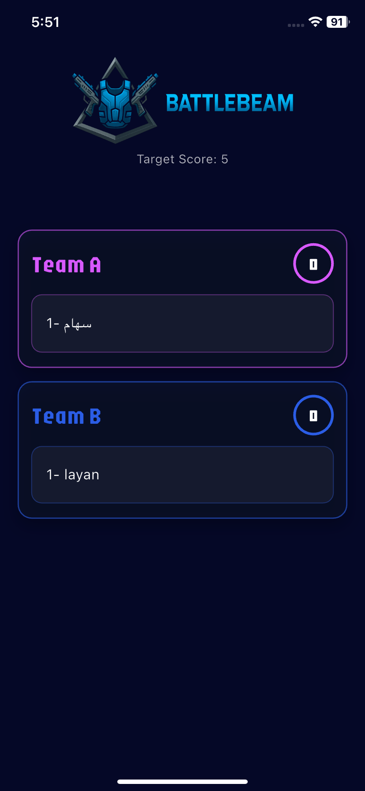<br><b>Live Scoreboard</b></td>
    <td align="center">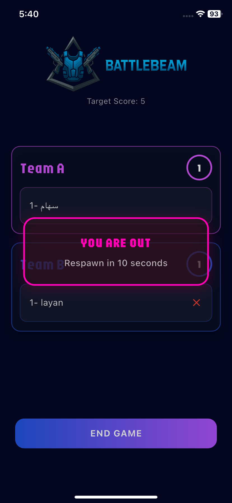<br><b>Hit / Respawn State</b></td>
    <td align="center">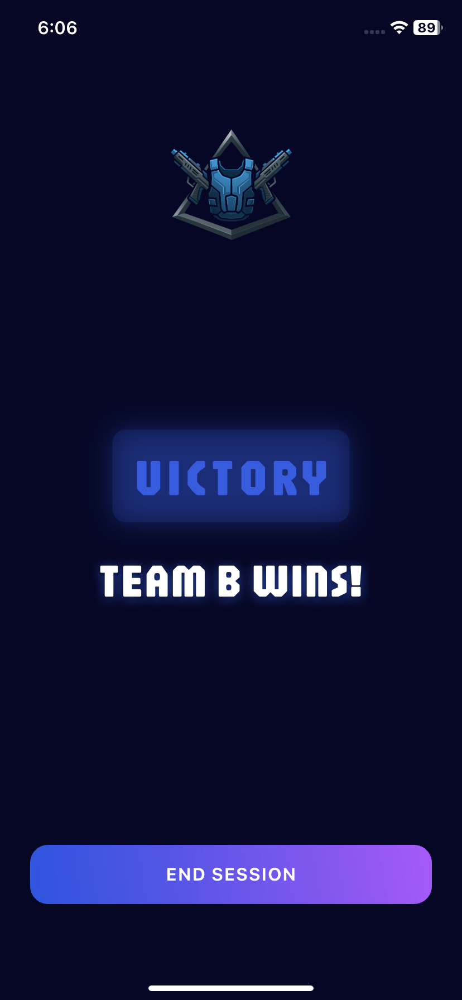<br><b>Victory Screen</b></td>
  </tr>
</table>

The first connected player becomes the **leader**. The leader can set the target score and start the game, while the other players wait in the lobby. During the match, connected devices receive live score and player-state updates.

---

## Core Features

- Two-team indoor laser-tag gameplay
- ESP32-based infrared guns
- ESP8266 wearable hit-detection vests
- Central ESP32 game hub
- Wi-Fi device communication
- Real-time WebSocket updates
- Flutter mobile application
- Player name and team selection
- Physical gun/vest assignment
- Leader-based game control
- Configurable target score
- Live team scoring
- Friendly-fire prevention using team IDs
- Temporary player cooldown after a valid hit
- Automatic player reactivation
- Victory and end-session flow

---

## Technology Stack

### Embedded Systems

- ESP32
- ESP8266
- Arduino / C++
- Infrared emitters and receivers
- Wi-Fi
- WebSockets

### Mobile

- Flutter
- Dart
- `web_socket_channel`
- `uuid`
- `audioplayers`
- `shared_preferences`

### Communication

- Local Wi-Fi network
- WebSocket messaging
- Encoded infrared transmission for shooting/hit detection

---

## Game Flow

```text
Power on Hub, Guns and Vests
            │
            ▼
 Mobile App Connects to Hub
            │
            ▼
 Enter Name → Choose Team → Select Equipment
            │
            ▼
         Join Lobby
            │
            ▼
 Leader Sets Target Score and Starts Game
            │
            ▼
 Gun Fires IR → Vest Detects Hit → Hub Validates Hit
            │
            ▼
  Score / Player State Updates in Real Time
            │
            ▼
 Team Reaches Target Score → Victory → End Session
```

---

## Gameplay Rules

### Friendly Fire

Each shot contains player/team information. The hub ignores hits from players on the same team, preventing friendly fire from increasing the score.

### Cooldown and Reactivation

After a valid hit, the affected player is temporarily disabled to prevent immediate repeated hits. Once the cooldown ends, the player's equipment is automatically reactivated.

### Leader

The first player to connect becomes the leader. The leader controls the target score and starts the match.

---

## Testing and Results

BattleBeam was tested as a complete integrated system, including the guns, vests, hub, mobile application, and communication between them.

Key tested results included:

- Gun IR transmission was reliable up to approximately **5 meters**
- Vest hit detection worked from **1–5 meters**
- Gun battery operation was tested for approximately **10 hours**
- Vest power-bank operation was tested for approximately **6 hours**
- Valid opposing-team hits updated the score correctly
- Friendly-fire hits were ignored
- Live scores were synchronized across connected mobile devices
- Player cooldown and automatic reactivation worked correctly
- Victory and end-session behavior were verified

The project was designed primarily for **indoor use**, where infrared communication can operate more consistently than in strong outdoor sunlight.

---

## Challenges and Solutions

### Coordinating multiple devices in real time

BattleBeam combines mobile clients, guns, vests, and a central hub. Keeping all devices synchronized required the hub to act as the central controller for game state and distribute updates through WebSockets.

### Preventing incorrect scoring

A detected IR signal should not automatically count as a valid point. The hub validates hit information, rejects friendly fire, and ignores hits that should not count during cooldown/respawn states.

### Repeated hits after elimination

Without a temporary disable state, a player could be hit repeatedly in a very short period. A cooldown/reactivation workflow was introduced to keep gameplay fair.

### Connecting physical equipment to app players

The mobile app includes equipment selection so each player can be associated with the correct physical gun and vest before gameplay begins.

### Working with IR limitations

Infrared performance can be affected by distance and strong sunlight. The system was therefore developed and tested primarily as an indoor home laser-tag system.

---

## Repository Structure

```text
battlebeam/
├── firmware/
│   ├── hub/
│   │   └── HUB.ino
│   ├── guns/
│   │   ├── GUN.ino
│   │   └── GUN1-B.ino
│   └── vests/
│       ├── vest2.ino
│       └── VEST2-B.ino
│
├── mobile-app/
│   ├── lib/
│   ├── assets/
│   ├── android/
│   ├── ios/
│   ├── pubspec.yaml
│   └── pubspec.lock
│
├── docs/
│   ├── images/
│   ├── BattleBeam-Final-Poster.pdf
│   └── BattleBeam-User-Manual.pdf
│
├── .gitignore
└── README.md
```

---

## Running the Project

BattleBeam is a hardware-dependent project, so running the complete system requires the ESP hub, gun and vest hardware in addition to the mobile application.

### 1. Flutter application

From the repository root:

```bash
cd mobile-app
flutter pub get
flutter run
```

### 2. Embedded firmware

The firmware is organized under `firmware/`.

Upload the appropriate sketch to each device using the Arduino IDE:

- `firmware/hub/HUB.ino` → central ESP32 hub
- `firmware/guns/` → ESP32 gun devices
- `firmware/vests/` → ESP8266 vest devices

Required Arduino libraries include the Wi-Fi/WebSocket, JSON, async networking and IR libraries used by the firmware.

> Third-party Arduino library source folders are intentionally not copied into this repository. Install the required libraries through the Arduino IDE Library Manager or their official sources.

---

## Limitations

The graduation-project scope intentionally focused on a straightforward home laser-tag experience.

Current limitations include:

- Indoor-focused IR communication
- Two-team gameplay
- No historical player/game database
- No GPS/player-location feature
- Battery-powered wearable hardware
- Handmade prototype durability
- No advanced game modes such as capture-the-flag

---

## Future Work

Potential improvements identified for BattleBeam include:

- Additional game modes
- RGB feedback
- Support for more players and larger play areas
- Additional weapon types and gameplay behavior

---

## What We Learned

Building BattleBeam required combining several areas of technology into one working system rather than treating the mobile app, networking, firmware, and physical hardware as separate pieces.

The project provided hands-on experience with:

- Embedded programming
- ESP32 and ESP8266 development
- Infrared communication
- Real-time WebSocket networking
- Flutter mobile development
- Hardware/software integration
- Multi-device synchronization
- Testing physical prototypes
- Debugging communication and gameplay logic
- Designing a complete end-to-end interactive system

---

## Project Documentation

Project documentation is available here:

- [View the BattleBeam Final Poster](docs/BattleBeam-Final-Poster.pdf)
- [View the BattleBeam User Manual](docs/BattleBeam-User-Manual.pdf)

---

## Project Context

BattleBeam was developed collaboratively as a university graduation project. This repository preserves the team's implementation and documents how embedded hardware, real-time networking, infrared communication, and a mobile interface were integrated into a complete working prototype.
